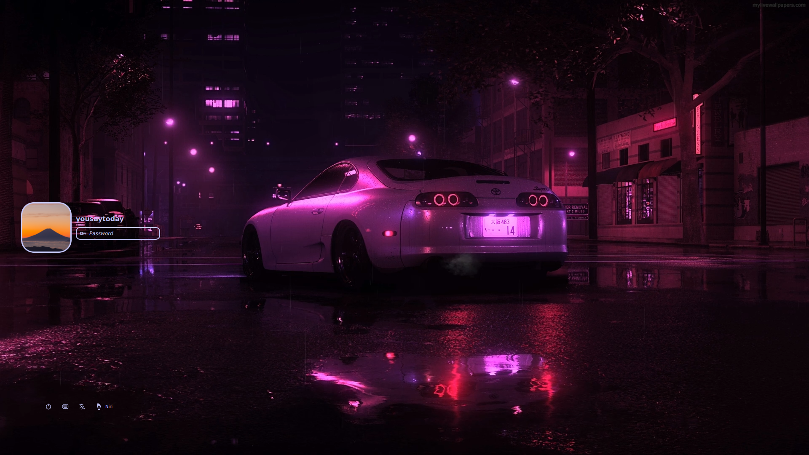

<div align="center">
  <h1>❄️ itslinux-btw Dotfiles</h1>
  <p>A modular, reproducible, and aesthetic NixOS configuration managed with Flakes and Home Manager.</p>
</div>

> [!WARNING]
> This is a personal NixOS configuration. Use it at your own risk; everything is hardcoded for my specific needs and hardware.


<video controls>
  <source src=".github/rice.mp4" type="video/mp4">
  Your browser does not support the video tag.
</video>

<details>
  <summary><strong>Screenshots</strong></summary>

  ### SDDM

  

</details>

## ✨ Features

- **OS**: [NixOS](https://nixos.org/) (Unstable, powered by [Lix](https://lix.systems/))
- **Management**: Nix Flakes & Home-Manager
- **Compositor**: [Niri](https://github.com/YaLTeR/niri) (Scrollable-tiling Wayland compositor) with [DMS](https://github.com/AvengeMedia/DankMaterialShell)
- **Display Manager**: SDDM
- **Theming**: Adwaita Dark GTK/QT theme with custom modules
- **Editors**: VSCodium & Neovim
- **Browsers**: Zen Browser & Brave

## 🛠️ Tools & Applications

Here is a comprehensive list of the primary tools and utilities used in this configuration:

### Terminal & Shell
| Tool | Description |
| :--- | :--- |
| `kitty` | Terminal Emulator |
| `nushell`, `zsh` | Shell Environments |
| `zellij` | Terminal Multiplexer |
| `starship` | Shell Prompt |

### Utilities & CLI
| Tool | Description |
| :--- | :--- |
| `yazi`, `nemo` | File Managers |
| `btop`, `fastfetch` | System Monitors |
| `git`, `lazygit` | Version Control |
| `bat`, `eza`, `unzip` | Command-line Utilities |
| `cava` | Audio Visualizer |
| `keyd` | Key Remapping |

### Desktop Environment
| Tool | Description |
| :--- | :--- |
| `DMS` | Desktop Shell |

### GUI Applications
| Tool | Description |
| :--- | :--- |
| `vesktop` | Discord Client |
| `obs-studio` | Screen Recorder/Broadcasting |
| `mpv`, `imv` | Media Players & Image Viewers |
| `gimp` | Image Editor |
| `keepassxc` | Password Manager |
| `libreoffice` | Office Suite |
| `scrcpy`, `localsend` | Device Utilities |

### Development
| Tool | Description |
| :--- | :--- |
| `distrobox` | Container Environment |
| `tailscale` | VPN & Mesh Network |
| `mysql` | Database System |
| `nodejs`, `python`, `java` | Programming Languages |

## 📂 Repository Structure

The configuration is organized into a modular tree for easier maintainability:

```text
.
├── config/             # Application config dotfiles (configfiles, dotfiles, themes)
├── modules/            # The core of the modular setup
│   ├── core/           # System-level features (networking, boot, sddm, etc.)
│   ├── program/        # User-level apps (browser, cli, editor, dev, db, etc.)
│   └── packages/       # Additional standalone packages
├── nix/
│   ├── config/         # Global NixOS configuration files
│   ├── flake/          # Flake definition (inputs/outputs)
│   ├── home-men/       # Home Manager configuration
│   └── host/           # Host-specific variables (variable.nix)
└── assets/             # Wallpapers and other static assets
```
